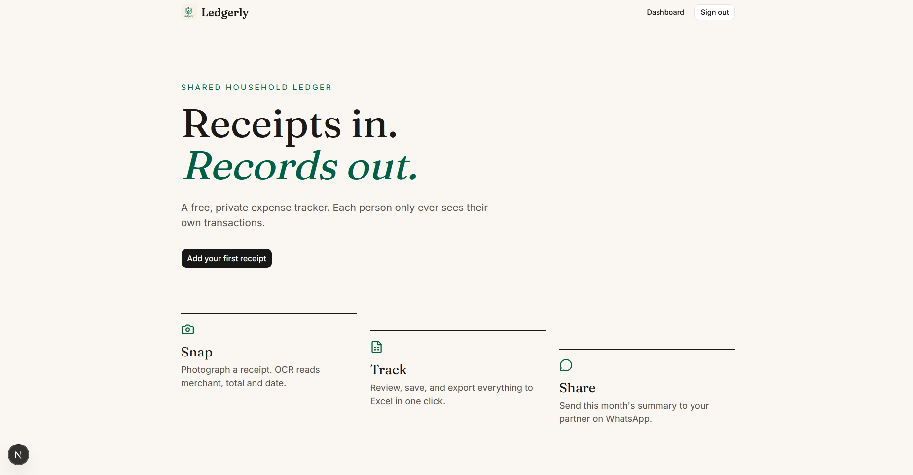

<div align="center">


# Ledgerly

### Receipts in. Records out.

**Snap a receipt. Get a clean transaction. Share the monthly report.**
A private, free expense tracker that reads Indonesian receipts, bank transfers and e-wallet top-ups for you.


</div>

<p align="center">
  
</p>

---

## Why Ledgerly?

Typing every coffee, parking fee and transfer into a spreadsheet is how expense tracking dies.
Ledgerly turns the **photo you already have** into a record in about five seconds, and keeps every person's data strictly their own.

| 📸 Snap | 🧾 Review | 📊 Track | 💬 Share |
| :--- | :--- | :--- | :--- |
| Camera or gallery, drag and drop | OCR pre-fills merchant, total, date and category | Income vs expense, balance, monthly summary | Export to Excel or send the summary on WhatsApp |

## Features

**Reads what Indonesians actually receive**
- 🛒 **Shop and cafe receipts** (Indomaret, Alfamart, restaurants, warung, coffee shops)
- 🏦 **Bank transfer proofs** (merchant becomes the beneficiary, category becomes *Transfer*)
- 👛 **E-wallet top-ups** (GoPay, OVO, DANA, ShopeePay and more)
- 📜 **Transaction-history screenshots**: one image can create *many* entries, reviewed in a single list

**Gets the total right**
- Always takes the **final paid amount, tax and service included**, ignoring subtotal, PPN, PB1, DPP, tips, rounding and change
- Handles `Rp 62 300`, `62.300,00`, `62,300.00` and `15.08` alike
- **Cross-checks the OCR**: `subtotal + tax` and `cash − change` must agree with the printed total, so a misread digit (191,475 read as 131.47) is corrected automatically
- Tries three OCR engines, then falls back to in-browser **Tesseract** if the OCR service is unreachable

**Built for daily use**
- ➕➖ Income / Expense, with auto-detection from wording like *received*, *diterima*, *gaji*
- 🇮🇩 Everything displayed in **IDR** (`Rp 38.500`)
- ✏️ Edit or delete any transaction inline, with a confirm step
- ⏳ Loading states everywhere: spinners, skeletons, disabled buttons
- 📱 Mobile first: open the camera or pick from the gallery

**Private by design**
- 🔒 **Row-Level Security**: each user can only read and write their own rows
- 🗄️ **Photos never pile up**: each upload goes to a private bucket, OCR reads it through a **60-second signed URL**, and the file is **deleted right after it has been read**
- 🔑 The OCR API key never leaves the server

## How it works

```
 photo ──► private Supabase Storage ──► signed URL (60s) ──► OCR.space (3 engines)
                                                          └─► Tesseract.js (fallback, in browser)
                                                                      │
                  Postgres + RLS ◄── review & edit ◄── parser + arithmetic cross-check
```

## Tech stack

| Layer | Choice |
| :--- | :--- |
| Framework | Next.js 16 (App Router, Server Actions, `proxy.ts`) |
| UI | Tailwind CSS 4, shadcn/ui, Fraunces + Inter, Sonner toasts |
| Auth, DB, files | Supabase (Auth, Postgres with RLS, Storage) |
| OCR | OCR.space API, with Tesseract.js fallback |
| Export | SheetJS (`xlsx`) |

## Getting started

**1. Install**

```bash
git clone <your-repo-url>
cd tracker
npm install
```

**2. Create a Supabase project**, then open **SQL Editor** and run [`supabase/schema.sql`](supabase/schema.sql). It creates the `transactions` table, RLS policies and the private `receipts` bucket.

**3. Get a free OCR key** at [ocr.space/ocrapi/freekey](https://ocr.space/ocrapi/freekey).

**4. Configure environment.** Copy `.env.example` to `.env` and fill it in:

```env
NEXT_PUBLIC_SUPABASE_URL=https://xxxx.supabase.co
NEXT_PUBLIC_SUPABASE_PUBLISHABLE_KEY=sb_publishable_...
OCR_SPACE_API_KEY=your_ocr_space_key
```

**5. Run**

```bash
npm run dev
```

Open <http://localhost:3000>, sign up, and add your first receipt.

> Tip: while testing, turn off *Confirm email* in Supabase → Authentication → Providers → Email.

## Project layout

```
app/                  routes: landing, login, dashboard, add receipt
actions/              server actions (OCR, sign out)
lib/parse-receipt.ts  receipt parser + total cross-check (self-test: npx tsx lib/parse-receipt.ts)
lib/parse-history.ts  multi-entry parser for transaction-history screenshots
supabase/schema.sql   table, RLS and storage policies
proxy.ts              protects /dashboard
```

## Good to know

- The parser is heuristic. Always glance at the review form before saving. Blurry, dark or skewed photos can still be misread, and *Show scanned text* helps you see why.
- Dates like `03/04/2026` are read as day/month (Indonesian format).
- OCR.space's free tier has a daily request limit. Photos are sent to that service for scanning. Tesseract runs fully in the browser if you prefer nothing leaves your device.
- There is no duplicate detection yet: uploading overlapping history screenshots can create the same entry twice.

## Roadmap

- [ ] Duplicate detection (same merchant, amount and date)
- [ ] Category picker and per-category charts
- [ ] LLM-based extraction for unusual receipts
- [ ] Per-user daily scan limit

---

<div align="center">

Made for people who keep forgetting to log that coffee. ☕

</div>
